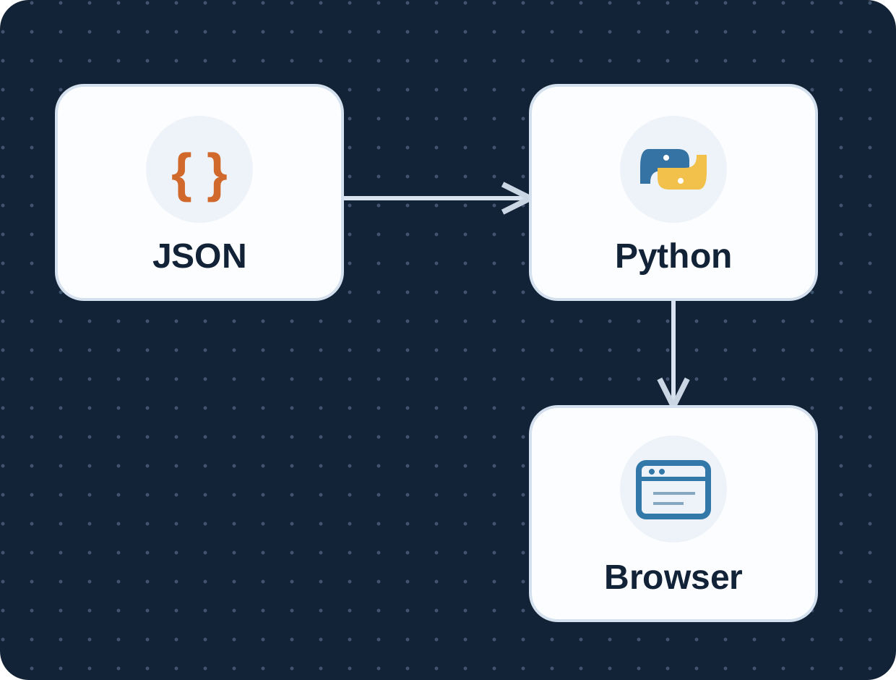
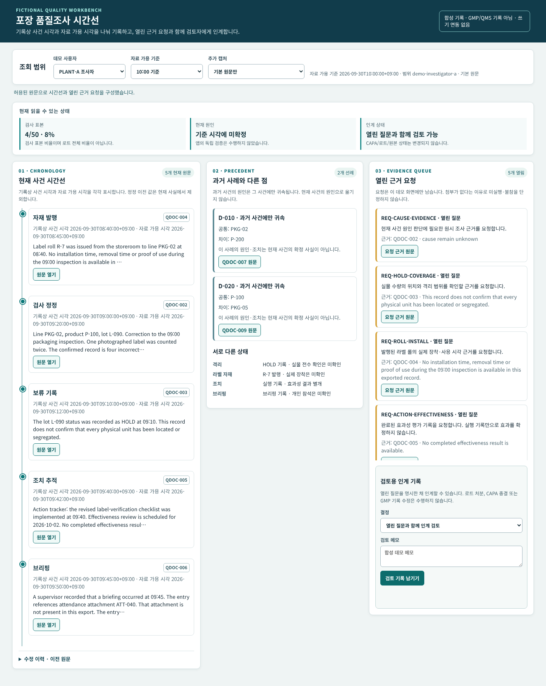
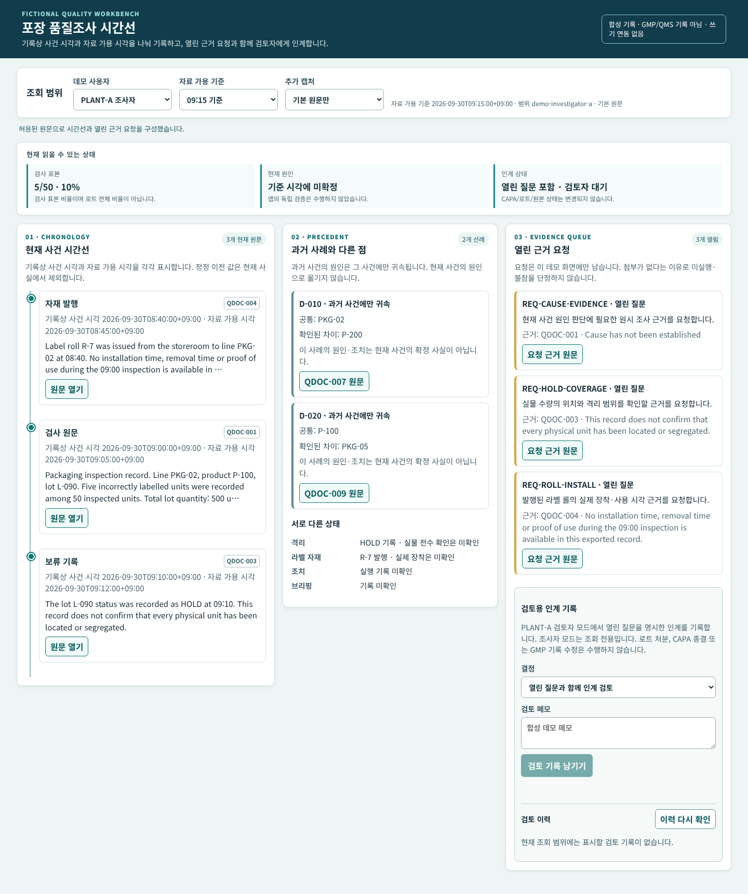
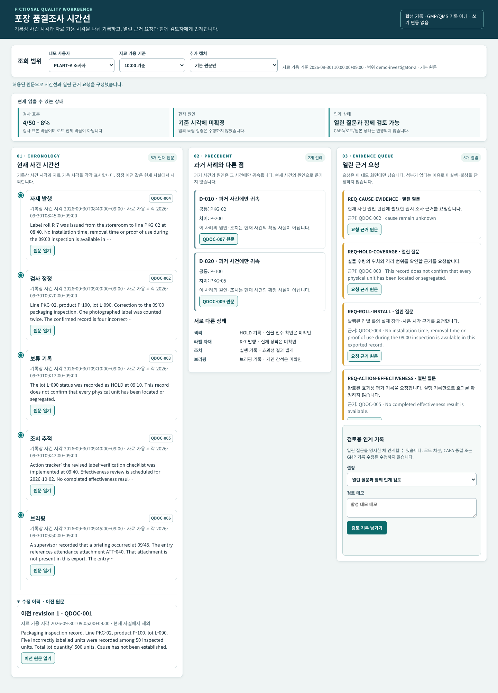
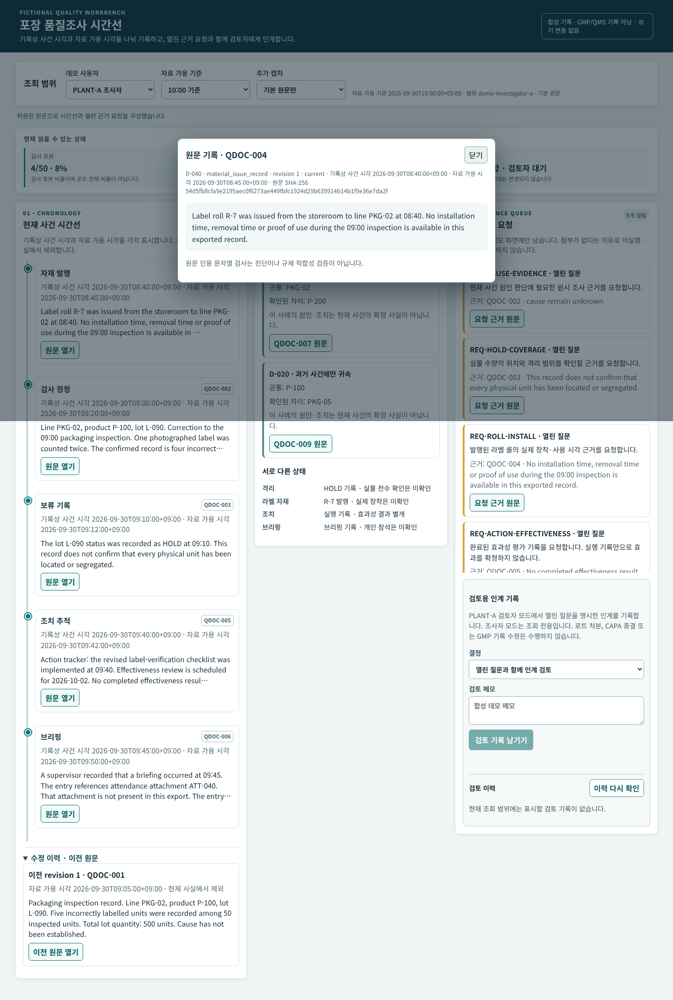
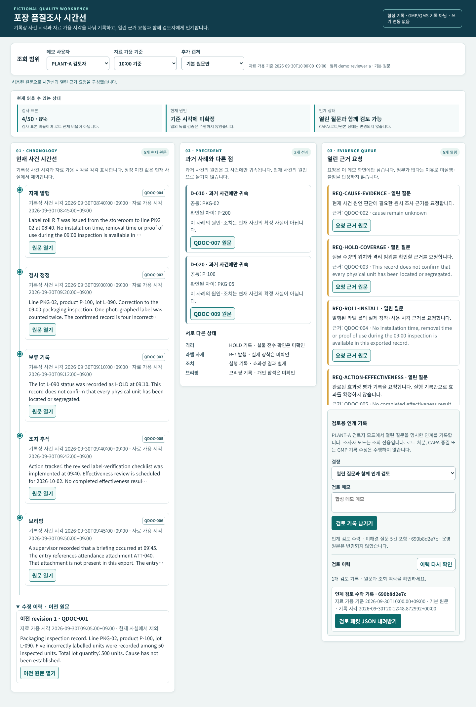
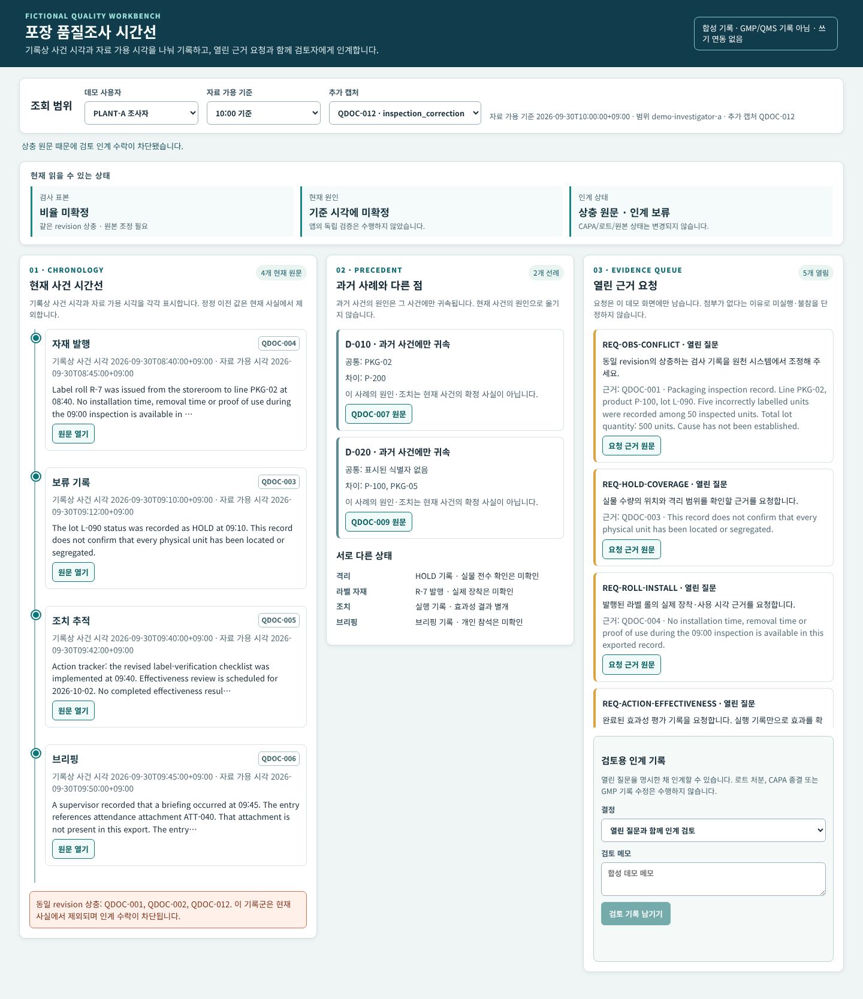
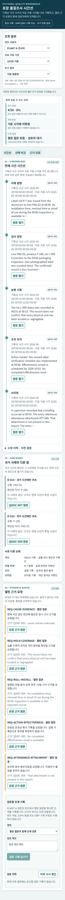

# 포장 품질조사 시간선과 근거 요청 대기열

합성 JSON 기록을 Python 서버가 사이트·역할·자료 가용 시각으로 먼저 거른 뒤 명시적 정정 관계를 재생합니다. 브라우저는 현재 시간선, 정정 전 원문, 과거 선례, 열린 근거 요청과 검토 인계 상태를 보여줍니다. [편집 가능한 SVG](assets/architecture.svg)와 [그림 출처·검증 기록](assets/PROVENANCE.md)도 포함합니다. 그림의 세 노드는 현재 CPU 구현이며 모델이나 외부 QMS 연동을 뜻하지 않습니다.

> **현재 범위:** 독립 합성 포장 기록만 사용하는 읽기 전용 조사 인계 데모. 사람의 인계 검토 수락은 열린 질문을 포함한 패킷을 검토했다는 로컬 기록입니다. CAPA 종결, 로트 처분, GMP 기록 수정, 실제 공장 제어는 없습니다.

## 어떤 업무를 재현했나

가상의 PLANT-A 포장 품질조사자는 오전 09:00 검사 기록을 확인합니다. 09:15 자료 가용 기준에서는 **5/50 = 10%**만 알 수 있습니다. 같은 사건의 정정 기록이 09:20에 가용해지면 **4/50 = 8%**를 현재 사실로 쓰고, 5/50은 수정 이력에만 남깁니다. 로트 총수량 500은 검사 표본의 분모가 아니며 로트 불량률은 모릅니다. 추가 캡처에서 같은 revision의 상충 원문이 나오면 해당 기록군을 격리하고 인계 수락을 막습니다.

라벨 롤 발행은 실제 장착·사용 증명이 아닙니다. 조치 실행 기록은 효과성 결과가 아닙니다. 참석 첨부가 내보내기에 없다는 것은 불참 증명이 아닙니다. 과거 유사 사건의 원인은 현재 사건의 확정 원인이 아닙니다. 11:05부터 읽을 수 있는 후속 결론도 **원문에 보고된 결론**으로만 표기하고 앱의 독립 검증이라고 하지 않습니다.

## 공개 기업 사례와의 관계

| 출처의 공개 업무 | 우리 합성 재현 | 검증되지 않은 것 |
|---|---|---|
| [Catalent, 2026-06-16 Qai 출시 발표](https://www.catalent.com/news/catalent-launches-qai-to-reimagine-quality-assurance-for-its-manufacturing-services): 회사가 deviation·complaint 조사와 품질 정보 활용을 설명 | 시점별 원문 시간선, 수정 관계, 근거 요청 | Catalent의 비공개 설계, 실제 성능·정확도 |
| [Microsoft 고객 사례, 2026-09-09](https://www.microsoft.com/en/customers/story/27171-catalent-azure-openai-in-foundry-models): 고객·공급자 설명상 거의 완료된 배포, 품질 전문가 검증, 읽기 전용 접근 | 조회/인계 경계, 사람 검토 영수증 | GMP 적격성, 제품 처분, 실제 QMS 쓰기/연결 |

기업·공급자 발표를 업무 참고로 인용합니다. 우리 프로젝트가 이들의 제품·아키텍처를 복제하거나 승인받았다는 뜻이 아닙니다. [문장별 근거와 성숙도](docs/evidence.md)를 따로 기록했습니다.

## 현재 구현

- **입장 전 필터:** 사이트, 데모 역할, 자료 가용 시각이 기준 시각 이하인지 검색·목록·상세·인용·인계보다 먼저 확인합니다. 데모 역할은 실제 SSO나 규제 서명이 아닙니다.
- **정정 재생:** 동일 source system·site·case·logical record 안에서 명시적 supersedes_id만 따라갑니다. 아직 접근할 수 없는 후속 정정은 기존 기록을 지우거나 암시하지 않습니다. 같은 revision의 서로 다른 원문/메타데이터는 해당 기록군 전체를 상충 상태로 둡니다.
- **결정론적 CPU 기준선:** 표본 분자·분모를 정확히 계산하고 원문 ID, SHA-256, 코드포인트 인용 span을 연결합니다. 격리·자재 발행·조치 실행·브리핑 상태의 미확인을 독립적으로 표시합니다.
- **과거 사례:** 허용된 두 사건만 비교하고 선례 원인을 현재 원인으로 복사하지 않습니다. 거부된 사이트의 기록은 응답과 수량에도 포함하지 않습니다.
- **검토 인계:** 허용된 검토자가 당시 패킷을 수락/반환하고 영수증을 조회할 수 있습니다. 패킷 fingerprint에는 입장 범위·cutoff·원문/메타데이터 해시·규칙과 질문이 들어갑니다. 원문이 바뀌면 기존 영수증은 stale입니다. 영수증은 현재 프로세스 메모리에만 있고 재시작하면 사라집니다.

## 설치·실행

Python 3.10+ 표준 라이브러리만으로 서버를 실행합니다. Node는 선택적 JS 구문 검사, Playwright와 Chrome은 선택적 실제 브라우저/캡처 검사에만 사용합니다. 프로젝트 루트에서 다음 명령을 실행하세요.

    python3 -m quality_queue.server --port 19094
    # 같은 컴퓨터에서 http://127.0.0.1:19094/

서버는 127.0.0.1에만 바인드됩니다. 실제 자료나 계정은 요구하지 않습니다. 시작 시 공개 합성 파일의 SHA-256을 확인합니다. 화면의 역할 선택은 시연용이며 네트워크에 노출할 인증 수단이 아닙니다. 포트가 사용 중이면 다른 비특권 포트를 지정하세요.

    python3 -m unittest discover -s tests -v
    node --check static/app.js
    python3 tests/browser_demo.py # Playwright, Chrome, 로컬 서버가 있을 때

## 검증 결과와 화면

2026-09-30 개발 체크포인트에서 **51개 CPU 계약/API 테스트**와 Node 구문 검사, 실제 Chrome 데스크톱·390px 브라우저 시나리오가 통과했습니다. 테스트 수는 엔지니어링 검사 수이며 진단 정확도 분모가 아닙니다. 브라우저 시나리오는 09:15의 5/50, 10:00의 4/50·수정 이력, 허용 원문, 열린 질문 5건의 검토 영수증, 상충 캡처의 수락 차단, 지연된 원문 응답과 cutoff 변경, 390px 가로 넘침 없음을 확인했습니다.

| 실제 UI 캡처 | 상태 |
|---|---|
|  | 10:00 현재 4/50 |
|  | 09:15 당시 5/50, 미래 정정 비표시 |
|  | 5/50은 이력에만 유지 |
|  | 원문과 사건/자료 가용 시각 |
|  | 미해결 질문 5건 포함 수락 |
|  | 현재 검사 수치 격리, 수락 차단 |
|  | 좁은 화면 작업 흐름 |

캡처는 실행 중인 로컬 앱을 Chrome에서 조작해 얻었고 편집해 성공을 꾸미지 않았습니다. 실제 Chrome 화면 녹화 [workflow.mp4](artifacts/demo/workflow.mp4)는 10.04초이며 UI에서 09:15/10:00·정정 이력·원문·인계·상충 상태를 조작한 과정입니다. [검증·캡처 기록](docs/test-manifest.md)에 실행 조건과 한계를 남겼습니다.

## 데이터·모델·평가 경계

입력은 독립 작성한 QUALITY-CHRONOLOGY-v1 합성 기록 **기본 11개와 상호배타적 추가 캡처 3개**입니다. 원본 패킷 전체 ZIP SHA-256은 1e0eaff74ad92c0f5526eda1a672038371c41b3718c592c88f397ef5854e97bb이며 공개 원문 파일 해시는 source-manifest.json에 있습니다. 합성 패킷은 원저작자가 CC0-1.0으로 제공했고 앱 코드는 [MIT](LICENSE)입니다. 링크된 Catalent/Microsoft 자료와 상표는 이 라이선스에 포함되지 않습니다. 원본 평가 oracle은 런타임·모델 입력·공개 앱 디렉터리에서 제외했습니다.

**실제 Qwen 개발용 호출은 v1·v2 각 1건, 총 2건이며 두 건 모두 개발 수락 기준에 실패했습니다.** v1은 현재 정정 원문을 과거 설명으로 오해해 관측값과 질문을 비웠습니다. [v1 원문·실측 실패](docs/model-v1-result.md)를 보존했습니다. [사전에 고정한 v2 계약](docs/model-v2-proposal.md)은 서버가 허용한 현재 원문 5개와 과거 원문 1개의 상태를 제공했습니다. 실제 설치 템플릿의 v2 입력 1,671토큰에 출력·여유 576토큰을 더해 4,096 문맥에 들어갔습니다. 모델은 현재 4/50과 과거 5/50을 구별한 원문 인용을 제안했지만, 과거 원인을 현재 주장으로 추가하고 질문을 영어로 썼으며 수치 원문 단어를 숫자로 바꿨습니다. [v2 원문·실측 분석](docs/model-v2-result.md)과 [요청·응답](evidence/model-dev-v2/)을 보존했습니다. 9개 평가 사례는 실행하지 않았고 성능 점수도 없습니다. CPU 시간선과 근거 요청은 모델 실패와 무관하게 사용 가능합니다. 현재 51개 테스트는 엔지니어링 검사 수입니다.

## 한계

원문 해시·인용 span의 일치는 원인 판단의 의미적 타당성, 물리적 격리, GMP 적합성, 실제 제조 품질 개선을 입증하지 않습니다. 문장 추출 규칙은 이 작은 영어 합성 기록의 제한된 서식에 맞춰져 있습니다. 검토 영수증은 메모리 안의 데모 기록이고 브라우저의 역할 선택은 인증이 아닙니다. 원문 텍스트에 있는 지시는 데이터일 뿐 실행 명령으로 사용하지 않습니다. [복사한 MIT 코드의 출처](docs/code-provenance.md)를 기록했습니다. 향후 모델 출력을 쓰더라도 입장·정정·수량 계산·검토 권한은 서버가 결정합니다.
